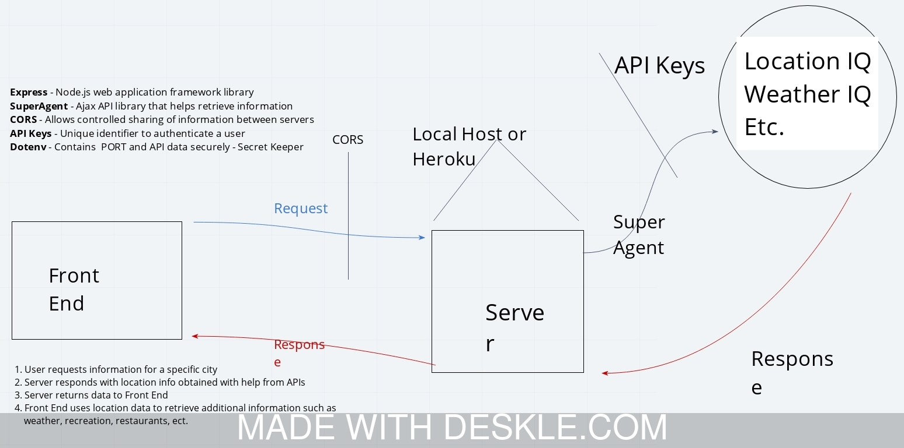
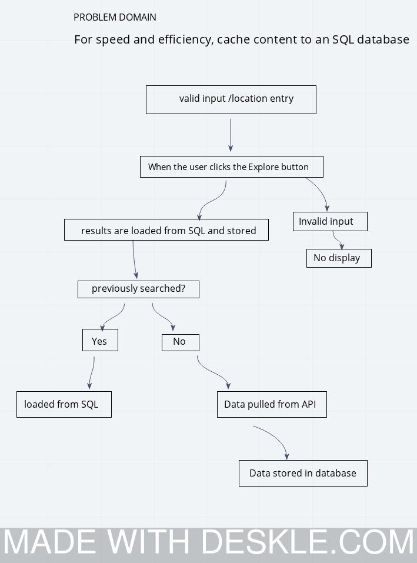

# city_explorer_api
Lab: 06 - Node, npm, and Express

# Project name: City Explorer

Author: Edgar Romero
Version: 1.4.0 

## Overview
In labs 6 through 9, you will be building a stand-alone back end which will interact with a static front end. You will request data from a total of six third-party APIs, modify the data as needed, and send the data to the client to be displayed in the browser. In labs 8 and 9, you will be persisting data in a SQL database.

Draw the web request response cycle for the task at hand (about 15 minutes). Document the data flow: identify inputs and outputs for each part of the cycle. Outline the functions that support this data flow. Do a formal code review of each person's code (15 minutes each). Open your partner's GitHub Pull Request on your laptop. Identify an area in the code that: you don't understand or seams overly complex or you see a way to improve or you want more information on or you really like or think is interesting Add kind comments or questions inline using the GitHub review feature. You will then work independently for the rest of the day, implementing your plan, coding in your own repository, submitting your own pull request.

You will have access to view the code base for the client, but will not be able to modify it in any way.

For this lab assignment, you will convert a location entered by the user into a latitude and longitude, then use those values to request weather information for that location. As your City Explorer back end progresses in labs 6 through 9, you will use the latitude and longitude to request information from other APIs from the same search query.

## Getting started 

## Architecture
The dependencies needed for today's lab include: express, cors, and dotenv. Note that the package-lock.json file is automatically created when dependencies are installed and ensures that future installations of the project use the same versions of the dependencies. lab-06-repository ├── data | ├── weather.json | └── location.json ├── .env ├── .eslintrc.json ├── .gitignore ├── package-lock.json ├── package.json └── server.js User Acceptance Tests

## Change log
<!-- Use this area to document the iterative changes made to your application as each feature is successfully implemented. Use time stamps. Here's an examples: -->

- 06-08-2020 6:20pm Application now has a fully-functional express server, with a GET - route for the location and weather resource.
- 06-08-2020 5pm Application now has a function Get route Trails.
- 06-09-2020 8pm Application now has API calls to query search  data.
- 06-10-2020 8:30pm Application now has persistence SQL database.
- 06-11-2020 6:10pm Application now has Movies DB API.

Number and name of feature: Lab 06 (day one) 06-08-2020

Estimate of time needed to complete: 4 hours

Start time: 2:30pm

Finish time: 6:50pm

Actual time needed to complete:4:20.

<!-- CLASS-07 LAB06 -->

 

Number and name of feature: Lab 07 (day TWO) 06-09-2020

Estimate of time needed to complete: 4 hours

Start time: 2:30pm

Finish time: 6pm

Actual time needed to complete:3:30.

<!-- CLASS-08 LAB08 -->

Number and name of feature: Lab 08 (day THREE) 06-10-2020

Estimate of time needed to complete: 3 hours

Start time: 2:30pm

Finish time: 8:30pm

Actual time needed to complete: 6 hours.

<!-- CLASS-09 LAB09 -->

Number and name of feature: Lab 09- add Movies DB (day FOUR) 06-11-2020

Estimate of time needed to complete: 3 hours

Start time: 2:30pm

Finish time: 6pm

Actual time needed to complete: 3:30.

Number and name of feature: Lab 09  add Yelp DB (day FOUR) 06-11-2020

Estimate of time needed to complete: 1 hour

Start time: 6:30pm

Finish time: 8:40

Actual time needed to complete: 2:10.

